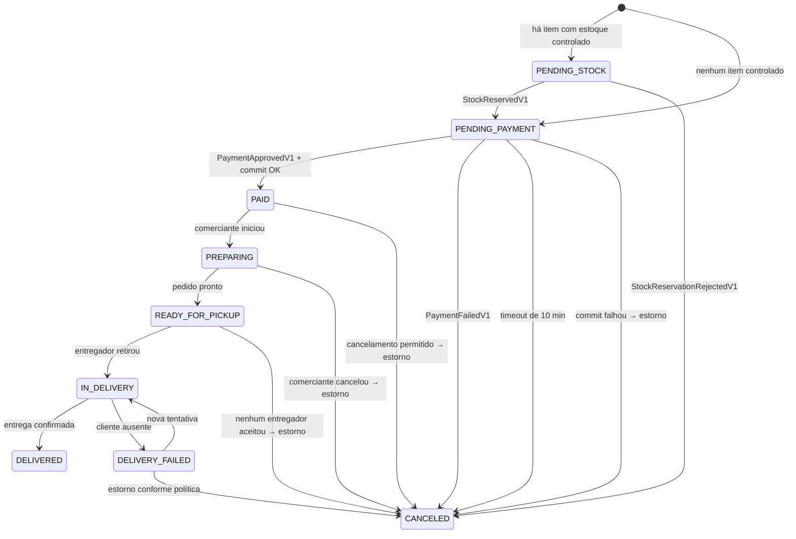

# ADR-010 — Caminho da Saga para itens sem controle de estoque

**Status:** Aceita — 16/08/2026
**Relacionada:** ADR-018 (`stockControlledSnapshot`), ADR-009 (valor cobrado)

## Contexto

O produto tem a flag `stockControlled`, e ela é `false` para a maior parte do
que se vende em delivery — comida preparada não tem saldo contado.

Mas a máquina de estados do pedido começava **obrigatoriamente** em
`PENDING_STOCK`, e a Saga sempre chamava o `inventory-service`. Ou seja: o
caminho mais comum do sistema — provavelmente a maioria dos pedidos — era o que
não havia sido desenhado, e pagava uma ida à rede para receber "não tenho nada a
reservar".

Havia ainda um risco silencioso: a `StockReservation` tem `expiresAt`, o
pagamento pode demorar, e nada definia o que acontece se a reserva expirar
enquanto o pedido aguarda aprovação. Cobrar sem estoque reservado é o pior
resultado possível.

## Decisão

### Entrada condicional

```
itens controlados = itens com stockControlledSnapshot == true

vazio   → pedido nasce em PENDING_PAYMENT, sem nenhuma chamada ao inventory
não vazio → pedido nasce em PENDING_STOCK
```

A reserva cobre **apenas** os itens controlados, e é **tudo-ou-nada** sobre esse
conjunto: reservar 3 de 4 e seguir é pior que falhar. Se qualquer item
controlado não tem saldo, a reserva inteira é rejeitada e o pedido cancelado —
antes de qualquer cobrança.

Como `stockControlledSnapshot` é congelado no item durante o checkout (ADR-018),
essa decisão não exige consultar o catálogo de novo.

### Janela de tempo

| Parâmetro | Valor | Motivo |
|---|---|---|
| TTL da reserva | 15 min | Precisa exceder a janela de pagamento com folga |
| Janela de pagamento | 10 min | Depois disso o pedido é cancelado por timeout |
| Folga | 5 min | Absorve latência de webhook e retry |

### Confirmação em duas fases

Ao receber `PaymentApprovedV1`, o `order-service` **compromete** a reserva
(`RESERVED → COMMITTED`) antes de declarar o pedido pago. Se o commit falhar
porque a reserva expirou, dispara-se estorno imediato e o pedido é cancelado com
`cancellationReason = STOCK_COMMIT_FAILED`.

Com a folga acima isso não deveria acontecer — e é exatamente por isso que
merece métrica e alerta.

### `cancellationReason`

```
STOCK_REJECTED · PAYMENT_FAILED · PAYMENT_TIMEOUT · STOCK_COMMIT_FAILED
CUSTOMER_REQUESTED · MERCHANT_REJECTED · NO_COURIER_AVAILABLE · DELIVERY_FAILED
```

Sem ele, "pedidos cancelados" no relatório é um número sem diagnóstico. Com ele,
`NO_COURIER_AVAILABLE` alto vira decisão operacional.

### Máquina de estados



A transição `READY_FOR_PICKUP → CANCELED` é a que fecha o buraco mais grave do
desenho anterior: sem ela, um pedido **pago** ficava preso para sempre quando
nenhum entregador aceitava, com comida pronta no balcão.

## Consequências

**Positivas**

- O caminho mais comum deixa de pagar custo de rede desnecessário.
- Nenhuma cobrança acontece sem estoque garantido, nos casos em que há estoque.
- O pedido nunca fica sem transição possível.
- Cancelamento passa a ter causa, e causa vira métrica.

**Negativas**

- Duas entradas na máquina de estados dobram os casos de teste do início do
  fluxo.
- O commit em duas fases exige que o `inventory-service` exponha uma operação de
  commit **idempotente** — a mensagem pode chegar duas vezes.
- `STOCK_COMMIT_FAILED` é uma anomalia que exige alerta e um procedimento
  operacional, não só um `catch`.

## Alternativas consideradas

- **Reservar sempre, mesmo sem item controlado.** Rejeitada: chamada de rede em
  mais da metade dos pedidos para receber "nada a fazer", e um estado
  `PENDING_STOCK` que mente sobre o que está acontecendo.
- **Reservar apenas quando o pagamento for aprovado.** Rejeitada: abre janela de
  venda de estoque inexistente entre o checkout e a aprovação, que é justamente
  o intervalo mais concorrido.
- **Reserva sem expiração.** Rejeitada: carrinho abandonado prenderia estoque
  para sempre — o mesmo defeito encontrado no projeto anterior.
